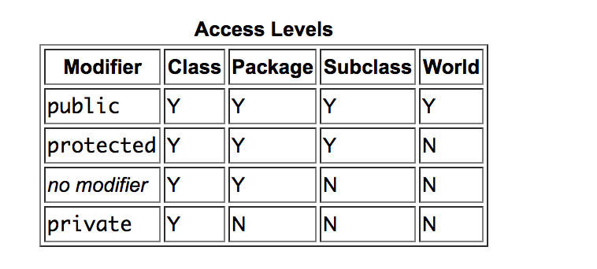

# Packages and Access Modifiers

## Learning Objectives

- Understand that you can organise your code in packages

## Introduction to packages.

Packages are essentially groups of classes in a folder. Their purpose is to organise your classes in a structured way.
Now we are going to work off a simple project that has a few packages.

```
    Hand out packages start point
```


Okay, we can see we have two packages, one for animals and one for humans. These packages will contain the respective code. A dog is inside the animal package and has a public string name and bark, and human class inside the human package and has a teach method that accepts a dog class.

So if we we were look at the folder structure of our codebase. It would look like this (each package name is its own folder):

```
            / - packagesexample
                / - src
                  / - main
                    / - java
                      / - animal
                        / - Dog.java
                      / - human
                          / - Trainer.java
```

So in Ruby, when we wanted Trainer to see Dog, we would write a require_relative(./../animal/dog).  We did similar in JavaScript with require(). In java we say

```
import Animal.Dog;
```

We could say

```
import Animal.*;
```

Which will import all classes from that animal package, but its considered bad practice if we only needed one. So change the import back to Dog.

Intelij should help you out via auto import if you have it turned on.

We can create subpackages in packages (they will just become subfolders).

Create a package called air inside animal. Create Bird class.

Inside Trainer, we can import the Bird like so

```
import Animal.Air.Bird;
```

Note we cannot say

```
import Animal.Air.*;
```

To import the bird, this is because * is not recursive, only pulls it in from that folder and not subfolders.

## Access Levels

Your package structure has a direct impact on how classes have access to methods and attributes.



At the moment the trainer can change the dogs names as its public, if we change it to private it can no longer change it.

Class attributes should always be private with getters and setters used to access and modify them.
